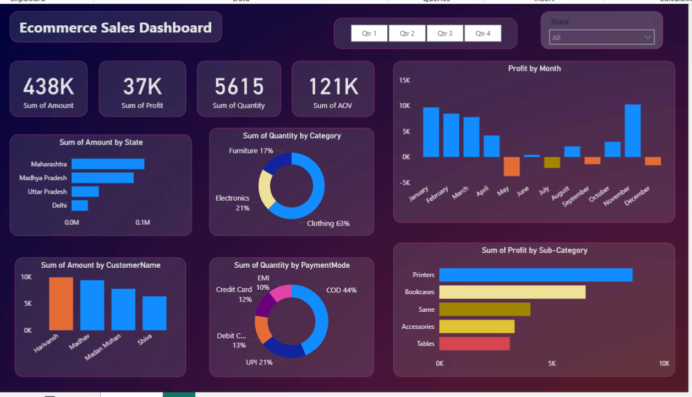
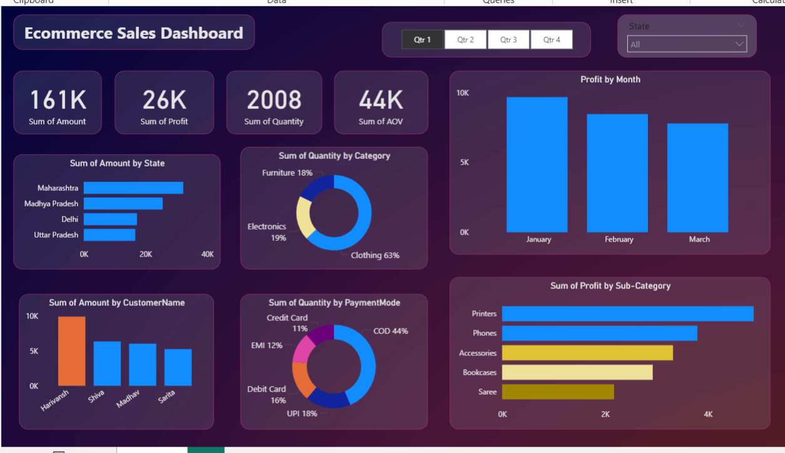
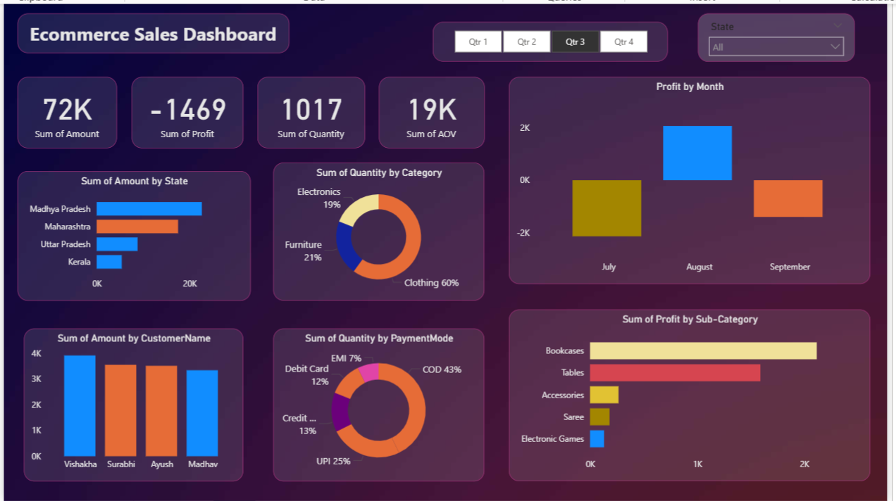
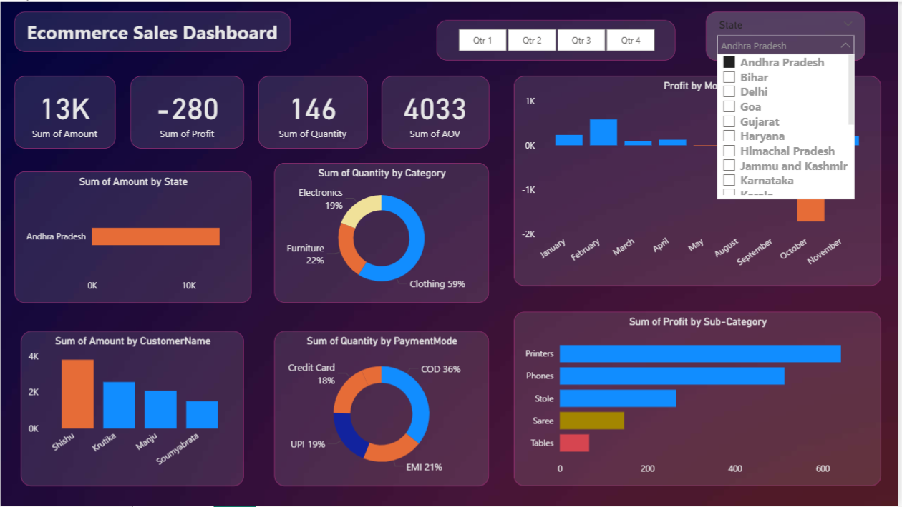
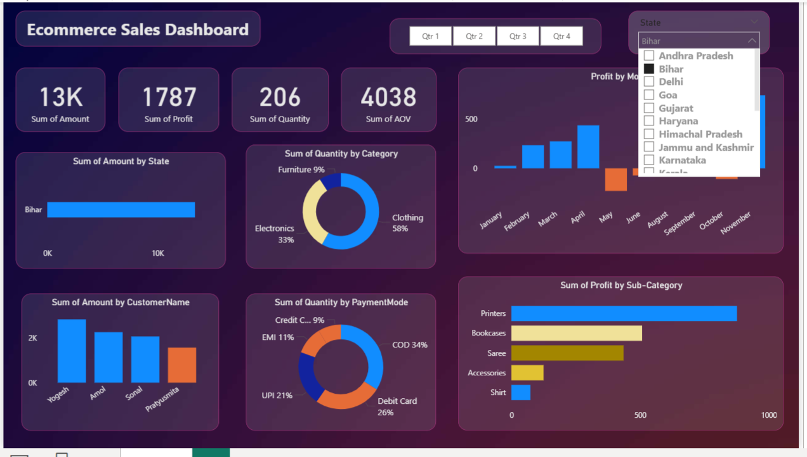

# 🛒 Ecommerce Sales Dashboard

## Project Overview
Built an interactive Power BI dashboard to analyze ecommerce 
sales performance across products, categories, and regions.

## Problem Statement
The business lacked a centralized view of sales performance. 
This dashboard provides real-time insights into revenue, profit, 
and customer buying patterns.

## Tools Used
- Power BI Desktop
- Microsoft Excel (data cleaning & preparation)
- DAX (calculated columns and measures)

## Key Features
- Sales & profit trend analysis (monthly/quarterly)
- Top performing product categories
- Region-wise sales breakdown
- Customer segment analysis
- KPI cards: Total Sales, Total Profit, Total Orders, Avg Order Value

## Key Insights
- Identified top 5 products contributing 60% of total revenue
- Found Q4 as peak sales season across all categories
- Western region showed highest profit margin

## Dashboard Preview

## Dataset
- Source: Kaggle Ecommerce Dataset
- Contains: Order ID, Product, Category, Sales, Profit, Region, Date

## Skills Demonstrated
- Data cleaning and transformation
- DAX measures and calculated columns
- Interactive slicers and filters
- Data storytelling through visualization
